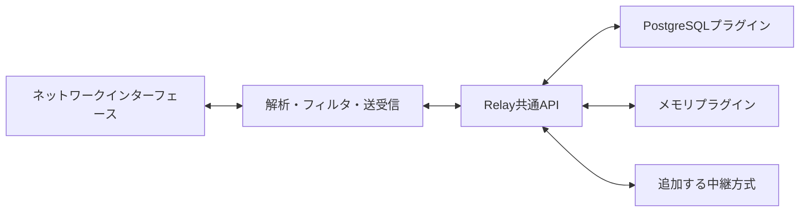

# 中継方式をプラグインとして追加する

stegrdbはEthernetフレームを中継する。DBへの保存方法、メッセージキューの使い方、別プロセスとの通信方式は、中継プラグインが決める。パケットの解析・フィルタ・NICへの送受信はコアが担当する。

この版ではRustクレートを追加して再ビルドする。共有ライブラリを実行中に読み込む機能は持たない。



## 共通APIにはフレームと受領情報だけを渡す

`crates/relay`はSQL、PostgreSQLの型、raw socket、フィルタルールを知らない。

| API | 責務 |
| --- | --- |
| `RelayPlugin::connect` | プラグイン固有の設定を検証し、指定channel/node_idの中継を作る |
| `Relay::publish` | フレームのバッチを受け付ける。同じIDの再試行で重複を作らない |
| `Relay::receive` | 未処理のフレームを上限件数まで取得する。取得だけでは処理済みにしない |
| `Relay::acknowledge` | 完了した受領情報を記録する。同じ受領情報の再試行を許容する |

`Frame`はUUIDと元のEthernetフレームを持つ。UUIDは収集時に一度だけ生成し、再試行でも変えない。同じUUIDを別の内容に使い回してはいけない。`Receipt`はプラグインが発行する受領情報で、コアは値を解釈せずに返す。

`channel`が同じノード同士で中継し、送信元自身には返さない。各ノードは同じchannel内で一意の`node_id`を持つ。プラグインは同じIDの多重接続を拒否する。

非同期呼び出しはタイムアウトで中断されることがある。`publish`と`acknowledge`は、呼び出し元に成功が返らなくても処理が完了している可能性を考慮し、再試行を安全に扱う。`receive`は中断されても未処理データを消さない。

## 新しいプラグインは3か所へ追加する

1. `plugins/<名前>`にRustクレートを作り、`stegrdb-relay`に依存させる。`RelayPlugin`と`Relay`を実装する。
2. ルートの`Cargo.toml`に依存を追加する。外部サービス用の依存が重ければ、PostgreSQL実装と同じようにCargo featureで切り替える。
3. `src/plugins.rs`の`builtin_plugins()`で登録し、`stegrdb.toml`の`relay.plugin`を指定する。

プラグイン固有の設定は`[relay.options]`で受け取る。APIにはJSON互換の値として渡るため、各実装が自分の設定型へ変換する。DB接続情報などのシークレットは設定値そのものを持たず、環境変数名を指定する。

送受信の検証には`plugins/memory/tests/delivery.rs`が参考になる。自ノードの除外、channelの分離、未ACKデータの再取得、送信とACKの冪等性、多重接続の拒否を確認する。順序、保持期間、永続性は実装ごとに文書化する。

## PostgreSQLはノードごとの未処理キューを持つ

`plugins/postgres`にSQL、TLS、接続プール、ノードの登録をまとめた。TimescaleDB拡張は必須ではなく、通常のPostgreSQLで動く。旧版のパケットログ用テーブルはこのプラグインから参照しない。

- `frames`: フレーム本体。`(channel, id)`の一意制約で送信再試行を重複させない。
- `nodes`: 登録ノード。再起動後も同じIDを使う。
- `pending`: ノードごとの未処理フレーム。送信成功後のACKで該当ノードの行だけを削除する。

バッチ保存と各ノードの`pending`作成は同じトランザクションで行う。新規ノード登録と送信が交差しても欠損しないよう、同じchannelでは登録・保存をトランザクション単位のadvisory lockで直列化する。取得とACKはこのロックを取らない。

同じchannelの複数送信元はこのロックを共有するので、書き込みを無制限に並列化する設計ではない。複数channelは独立して進む。大規模な負荷でこのロックが支配的になった場合は、別プラグインやノード登録方式の見直しを検討する。

受信時は`pending`を順に読む。時刻や最大IDを「ここまで処理済み」というカーソルに使わないため、同時刻のデータや遅れてコミットされたデータを取りこぼさない。PostgreSQLのシーケンス値はコミット順を表さないため、単にtimestampを連番へ置き換えるだけでは不十分だった。[PostgreSQLの分離レベル](https://www.postgresql.org/docs/current/transaction-iso.html)

初回登録では`replay_window_ms`以内の既存フレームも取り込む。再起動時は未処理キューを引き継ぐ。新規データだけにする場合は初回登録時の`replay_window_ms`を0にする。

接続プールは規定で4接続まで。これとは別に、ノードの多重起動を防ぐ専用接続を1本持つ。この接続が切れた場合はノード占有を確認できないため停止する。再起動すると未処理キューから再開する。TLSはOSのルート証明書で検証し、明示した`sslmode=disable`以外は平文へ切り替えない。

## 障害時の保証と運用上の制約

保存済みの未処理フレームは、ACKされるまでキューに残る。ただし、NICへの注入とDBのACKを一つのトランザクションにはできない。注入直後にプロセスが落ちると、再起動後に同じフレームを再送する可能性がある。これはat-least-onceの配送であり、exactly-onceの保証ではない。

収集した直後のデータはメモリ上にある。正常停止では収集を止めて残りを送るが、強制終了や停止タイムアウトでは未保存データが失われる。停止タイムアウトはエラーとして返し、未保存件数を記録する。受信側のACKが残っていないかは中継先のキューも確認する。

PostgreSQLの保存データは自動削除しない。オフラインの登録ノードにも未処理データを積むため、長期運用では保存容量の監視と保持方針が必要になる。削除する場合は、再試行が届く最大時間より長くデータを残したうえで、全ノードのACKが済んだフレームを対象とする。

```sql
-- 例: 全ノードのACKが済み、1日以上経過したフレームだけを削除する。
DELETE FROM stegrdb_relay.frames AS frames
WHERE created_at < NOW() - INTERVAL '1 day'
  AND NOT EXISTS (
    SELECT 1 FROM stegrdb_relay.pending AS pending
    WHERE pending.channel = frames.channel AND pending.frame_id = frames.id
  );
```

削除後に古いUUIDで再送すると、新規フレームとして扱われる。廃止ノードの登録を削除すると、そのノードの未処理キューも削除される。どちらも運用側で保持期間を決めてから行う。

メモリプラグインは同一プロセス内の検証用で、別マシンへ通信しない。プラグインのインスタンス単位で状態を共有し、規定の4,096フレームで満杯になると再試行可能なエラーを返す。ACK後も重複排除のため保持し、プロセス終了で全データが消える。

中継するLANと、DBなどへ接続するネットワークは分ける。同じインターフェースで全通信を許可すると、中継方式自身の通信を再び取り込む可能性がある。同じL2ネットワークに複数の中継ノードを置く構成も、外部で回り込んだフレームのループを避ける設計が別途必要になる。
